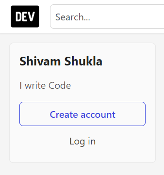

# DOM Manipulation 

 

1. Webiste Name: [Dev To](https://dev.to/)

### Topics

    - Query Selctory, Inner HTML

### Sample Image

### Tasks

        Target the Top description div and change the DEV Community to <Your_Name> and description to your passion

### Code

    document.querySelector(".side-bar .crayons-subtitle-2").innerHTML = "Shivam Shukla"
    document.querySelector(".side-bar .color-base-70").innerHTML ="I write Code"

### Output

2. Website Name: [Apple](https://support.apple.com/en-in)

### Task

### Fetch all the product name and store in an array

### Code

     let arr = []; document.querySelectorAll(".as-imagegrid-item").forEach((e) => arr.push(e.innerText.replace("\nSupport", ""))); 

### Output

['iPhone', 'Mac', 'iPad', 'Watch', 'AirPods', 'Music', 'TV']

---

3. Webiste Name: [Youtube Support](https://support.google.com/youtube/)

### Topics

    - Get Element By Id, Create Element, Create Text Node, Append Child

### Sample Image

### Tasks

     Add another FAQ 'My New FAQ' to the list

### Code

     let card = document.querySelector(".article .accordion-homepage"); let list = document.createElement("section"); list.className = "parent"; list.appendChild(document.createElement("h3")); list.querySelector("h3").textContent = "My New Faq"; card.appendChild(list);

### Output

​

---

4. Webiste Name: [OnePlus](https://www.oneplus.in/support)

### Topics

     Query Selector, InnerText

### Sample Image

### Tasks

      Change the contact number

### Code

     document.querySelector(".customer-support .one-tel-number").innerText = "7677263012"

### Output

---
5. Webiste Name: [Samsung](https://www.samsung.com/in/offer/online/samsung-fest/)

### Topics

       getElementById, createElement, InnerText, append, setAttribute

### Sample Image

### Tasks

     Target the main div of card and change the Button text to Check out

### Code

      document.querySelector(".feature-column-carousel__button .cta").innerText = "Check Out"

### Output

---
6. Webiste Name: [Adidas](https://www.adidas.co.in/)

### Topics

    -   Query Selector, Event listeners, Changing Styles

### Sample Image

### Tasks

     Target the search box and on hover change thebackground color to red.

### Code

     document.querySelector(".searchinput___zXLAR").style.backgroundColor="red"

### Output

---
7. Webiste Name: [MDN Web Docs](https://developer.mozilla.org/en-US/)

### Topics

       Form, Value, Submit

### Sample Image

### Tasks

     To Search a topic in the MDN Search bar.
     First add a text to search in the search bar and then hit the submit search button to search the docs using DOM

### Code

      function search(e){
      let input = document.querySelector("#hp-search-input");
      input.value = e;
      let form = document.querySelector("#hp-search-form");
      form.submit();
      }
      search('css'); 

### Output

---
8. Webiste Name: [Google](https://www.google.com/)

### Topics

       Remove Elements

### Sample Image

### Tasks

     Remove alternate languages from the home page languages listed

### Code

     let arr = document.querySelectorAll("#SIvCob a");
     for(let i = 0; i < arr.length; i++){
     if(i % 2 == 0){
          arr[i].remove();
          }
     }

### Output

---
9. Webiste Name: [Code Wars](https://www.codewars.com/)

### Topics

       Change Font Family, Color of Text.

### Sample Image

### Tasks

    Change the font family of the text to monospace and text color to the logo’s background color.

### Code

    document.querySelector(".display-heading-1").style.fontFamily = "monospace"
    document.querySelector(".display-heading-1").style.backgroundColor = "orange"
    document.querySelector(".display-heading-1").style.color = "red"
     

### Output

---
10. Webiste Name: [Freecodecamp](https://www.freecodecamp.org/)

### Topics

       querySelector, mouseover, click eventListener,  callback function, style,

### Sample Image

### Tasks

    Target the button and change background colour on mouseover

### Code
     document.querySelector(".col-lg-8 .login-btn-text").addEventListener("mouseover", function hover() {document.querySelector(".col-lg-8 .login-btn-text").style.backgroundColor = "red";});

### Output

---
11. Webiste Name: [realme](https://www.realme.com/in/)

### Topics

       querySelector,style,background-image

### Sample Image

### Tasks

    change the realme logo to ineuron logo

### Code

     document.querySelector(".logo .icon").style.backgroundImage = "url('https://ineuron.ai/images/ineuron-logo.png')";

### Output

---
12. Webiste Name: [Github](https://github.com/)

### Topics

       querySelector,style,background-Color

### Sample Image

### Tasks

     change the background colour of the button to blue.

### Code

     document.querySelector(".dashboard-sidebar .Details.js-repos-container .f4 .btn").style.backgroundColor = "blue";

### Output

---
13. Webiste Name: [Hackerrank](https://www.hackerrank.com/)

### Topics

       querySelector,innerHtml

### Sample Image

### Tasks

      Target the top description and change “Matching developers with great companies” to ‘JSBOOTCAMP“.

### Code

      document.querySelector(".fl-module-content .fl-heading").innerText = "JSBootcamp";

### Output

---
14. Webiste Name: [Asus](https://www.asus.com/in/)

### Topics

      querySelector,style,font-size

### Sample Image

### Tasks

       change the fontsize of “Hot Deals” to 80px

### Code

     document.querySelector(".HotDealsAll__HotCampaignsEventsContainer__FK0V2 .HotDealsAll__Heading__2fIbe").style.fontSize="80px;

### Output

---
15. Webiste Name: [Dell](https://www.dell.com/en-in/shop/deals/laptop-deals?gacd=10415953-9016-5761040-285981356-0&dgc=ST&gclid=Cj0KCQjwguGYBhDRARIsAHgRm4-XUDMhhVNyHXb3s1gY4ZBzORr_d9Se-buhJwy7asyUe7YdqEA11eEaAt6UEALw_wcB&gclsrc=aw.ds&nclid=BxjBlpBQsX6pjSHh-L8YYSU77EpfXRkG1AGMB5Wbeu386ykspfrPDnfx_DdFau20)

### Topics

      querySelector,style.textAlign

### Sample Image

### Tasks

       Convert the text “G15 Gaming Laptop” from left to right

### Code

     document.querySelector("#main-content-container .row .col-md-6 .mb-2 .mb-md-0 .page-title").style.textAlign = "right";

### Output

---
16. Webiste Name: [Vercel](https://vercel.com/)

### Topics

     querySelector,innerHTMl

### Sample Image

### Tasks

      change the heading “Start with the developer” to “Start with Scratch”\

### Code

document.querySelector(".section-title_title__VEDfK").innerText = "Start with Scratch";

### Output

---
17. Webiste Name: [Sony](https://www.sony.co.in/)

### Topics

    querySelector,innerHTMl

### Sample Image

### Tasks

     change the button text To current Date.

### Code

     let date = new Date; document.querySelector(".btn-container").innerText = date;

### Output

---
18. Webiste Name: [Philips](https://www.philips.co.in/)

### Topics

     querySelector,style,backgroundcolor

### Sample Image

### Tasks

    change the background colour blue to orange

### Code

     querySelector(".globalfooter .p-f03-footer-container .p-footer").style.backgroundColor = "orange";

### Output

---
19. Webiste Name: [Canon](https://in.canon/)

### Topics

          querySelector,src

### Sample Image

### Tasks

    extract the canon logo

### Code

     document.querySelector(".navbar-brand").innerText = "https://in.canon/assets/brand/logo-300-002e45a4aec98fd92899838da9d5560f.png"

### Output

---
20. Webiste Name: [Oppo](https://www.oppo.com/in/)

### Topics

          querySelector,style,color

### Sample Image

### Tasks

      Change the description colour black to orange

### Code

document.querySelector(".product-card-content .wide .desc").style.color = "orange";

### Output

